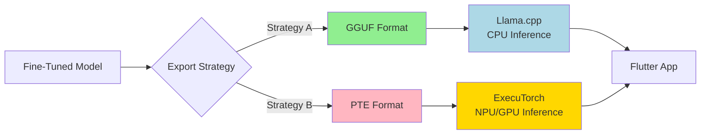
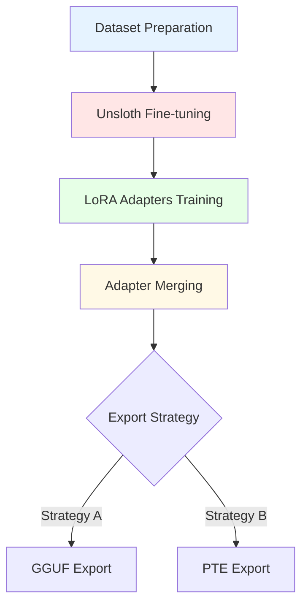
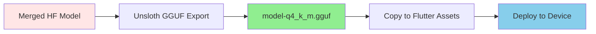
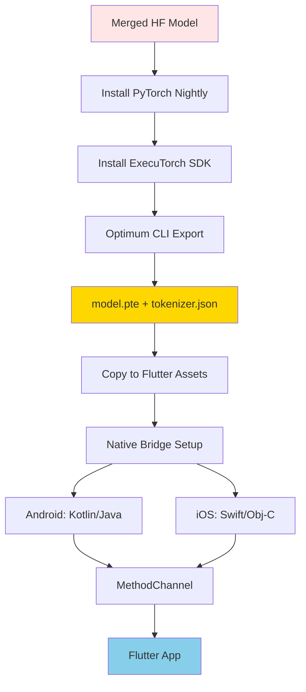
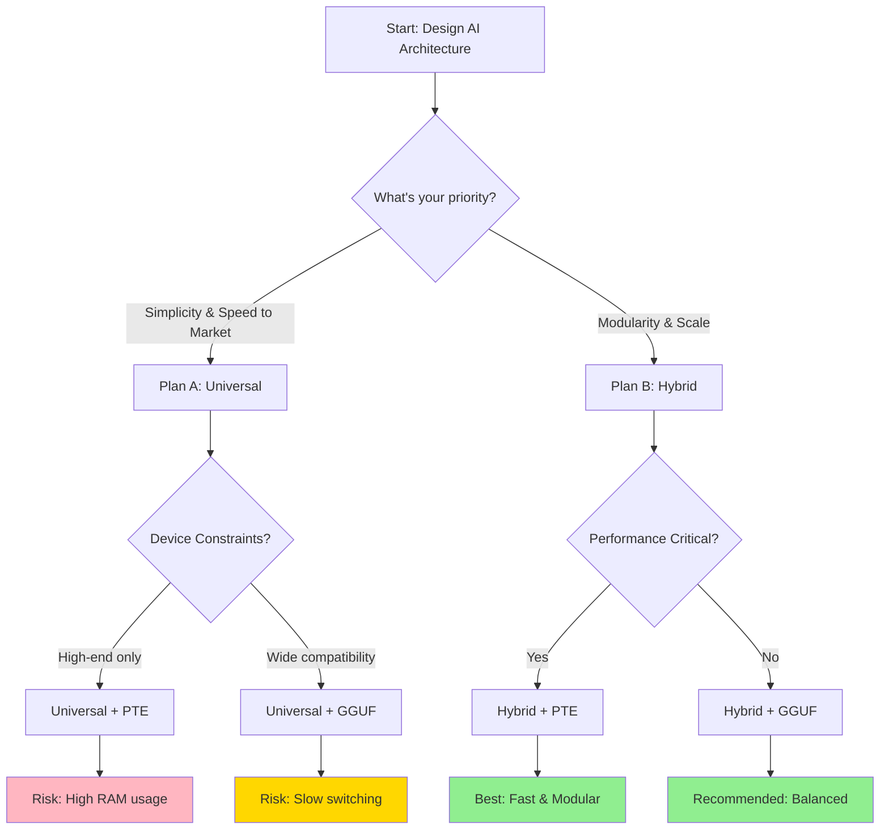
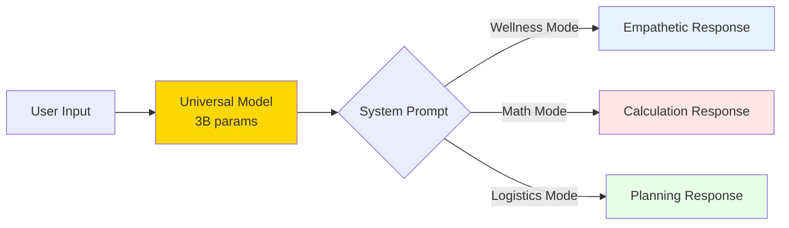
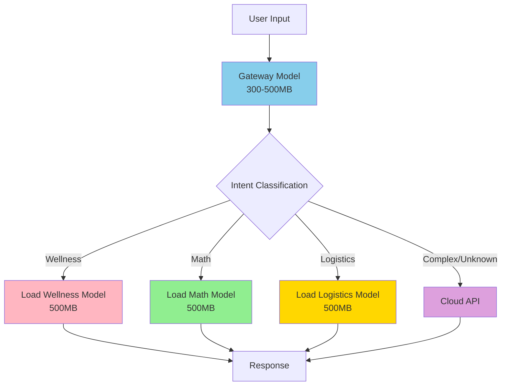
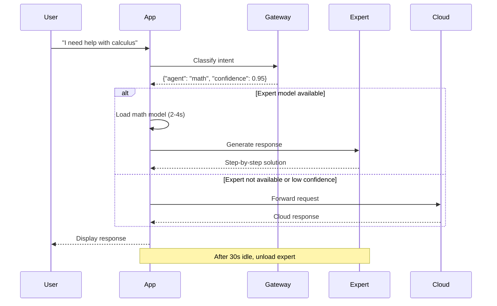
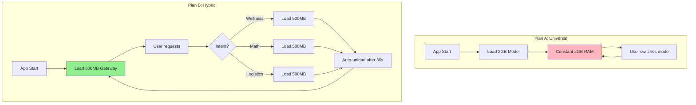
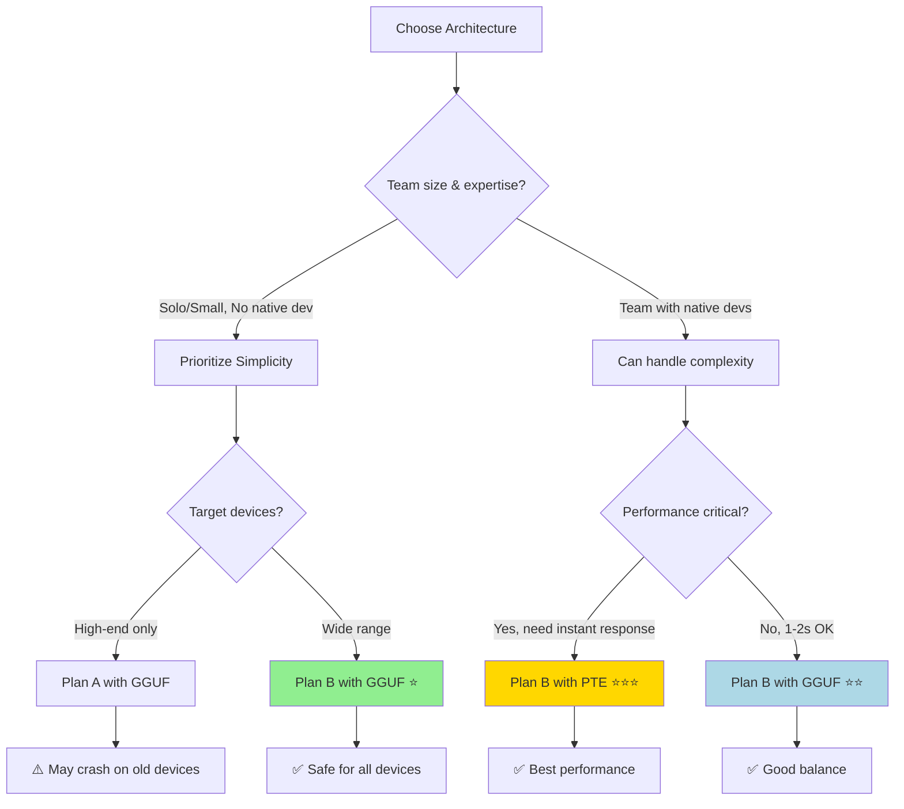

# Local AI Models: Complete Mobile Deployment Guide
## iOS & Android using Unsloth, Llama.cpp (GGUF), and ExecuTorch (PTE)

**Version:** 2.0  
**Date:** January 2026  
**Target Framework:** Flutter  
**Document Type:** Comprehensive Implementation Guide

---

## Table of Contents

- [Part 1: Mobile Deployment Strategies](#part-1-mobile-deployment-strategies)
  - [Executive Summary](#executive-summary)
  - [Prerequisites](#prerequisites)
  - [Strategy A: GGUF with Llama.cpp](#strategy-a-gguf-with-llamacpp)
  - [Strategy B: PTE with ExecuTorch](#strategy-b-pte-with-executorch)
- [Part 2: Arny Mobile AI Architecture](#part-2-arny-mobile-ai-architecture)
  - [Architectural Strategies Overview](#architectural-strategies-overview)
  - [Plan A: Universal Monolith Implementation](#plan-a-universal-monolith-implementation)
  - [Plan B: Specialized Hybrid Implementation](#plan-b-specialized-hybrid-implementation)
- [Part 3: Detailed Code Examples](#part-3-detailed-code-examples)
- [Part 4: Performance Analysis & Recommendations](#part-4-performance-analysis--recommendations)

---

# Part 1: Mobile Deployment Strategies

## Executive Summary

This guide outlines two distinct technical strategies for deploying custom, fine-tuned Large Language Models (LLMs) directly onto mobile devices (iOS and Android). Both strategies utilize **Unsloth** for efficient fine-tuning but diverge significantly at the export and inference stages.

### Strategy Comparison



### **Strategy A (GGUF) - Recommended for Most Use Cases**

**Engine:** llama.cpp  
**Target Hardware:** CPU (with some GPU support)  
**File Format:** `.gguf` (single binary file)  
**Flutter Integration:** Direct via `llama_cpp_dart` package

**Advantages:**
- ✅ High stability and mature ecosystem
- ✅ Broad device support (runs on any CPU)
- ✅ Zero native code required (pure Dart)
- ✅ Cross-platform consistency
- ✅ Easy to debug and maintain
- ✅ Smaller development overhead

**Disadvantages:**
- ❌ Slower inference than hardware-accelerated solutions
- ❌ Higher battery consumption on CPU-intensive tasks
- ❌ Limited to CPU performance capabilities

**Best For:**
- Rapid prototyping and MVP development
- Applications where 2-3 second response time is acceptable
- Teams without mobile native development expertise
- Cross-platform deployment requirements

---

### **Strategy B (PTE) - For Performance-Critical Applications**

**Engine:** ExecuTorch (PyTorch Mobile Stack)  
**Target Hardware:** NPU/GPU/CPU with hardware acceleration  
**File Format:** `.pte` (PyTorch Edge format)  
**Flutter Integration:** Manual via MethodChannels (Swift/Kotlin)

**Advantages:**
- ✅ Hardware acceleration (NPU/GPU)
- ✅ Significantly faster inference (<1s responses)
- ✅ Lower battery consumption with NPU
- ✅ Official PyTorch mobile support
- ✅ Memory-mapped model loading

**Disadvantages:**
- ❌ Complex setup and integration
- ❌ Requires native code (Swift/Kotlin/C++)
- ❌ Platform-specific optimizations needed
- ❌ Steeper learning curve
- ❌ More debugging complexity

**Best For:**
- Production applications requiring instant responses
- Apps targeting premium devices with NPU support
- Teams with native mobile development expertise
- Performance-critical use cases

---

## Prerequisites

### Development Environment

| Requirement | Specification | Notes |
|-------------|---------------|-------|
| **Python** | 3.10 or higher | Use Conda for environment management |
| **Training Hardware** | NVIDIA GPU | Google Colab T4/A100 recommended |
| **Flutter SDK** | 3.22+ | Stable channel recommended |
| **Target Devices** | iOS 16+ / Android 10+ | Minimum 4GB RAM (8GB for 3B models) |
| **Storage** | 5-10 GB free | For model files and build artifacts |

### Software Dependencies

```bash
# Python packages (install in virtual environment)
- unsloth (fine-tuning framework)
- torch (PyTorch for training)
- transformers (Hugging Face models)
- optimum (for ExecuTorch export)

# System tools
- Node.js 16+ (for Flutter tooling)
- Xcode 14+ (iOS development)
- Android Studio (Android development)
```

---

## Phase 1: Model Training (Common Core)

Both strategies begin with the same training process. We use **Llama-3.2-3B-Instruct** as the base model because it offers the optimal balance between model intelligence and mobile-friendly size.

### Why Llama-3.2-3B-Instruct?

- **Size:** ~6GB full precision, ~2GB quantized (fits in mobile RAM)
- **Performance:** Strong reasoning capabilities for mobile use cases
- **Instruction-tuned:** Pre-trained to follow instructions effectively
- **Mobile-optimized:** Designed with on-device inference in mind

### Training Architecture



### Step 1: Environment Setup

```bash
# Create a dedicated Conda environment
conda create -n unsloth_mobile python=3.10 -y
conda activate unsloth_mobile

# Install Unsloth (optimized for fine-tuning)
pip install "unsloth[colab] @ git+https://github.com/unslothai/unsloth.git"

# Install PyTorch (CUDA version for GPU training)
pip install torch torchvision torchaudio --index-url https://download.pytorch.org/whl/cu118

# Install additional dependencies
pip install transformers datasets accelerate bitsandbytes
```

### Step 2: Fine-Tuning Script

Create `train_mobile_model.py`:

```python
"""
Mobile LLM Fine-tuning Script
Uses Unsloth for efficient LoRA fine-tuning on Llama-3.2-3B
"""

from unsloth import FastLanguageModel
import torch
from transformers import TrainingArguments
from trl import SFTTrainer
from datasets import load_dataset

# ============================================================================
# CONFIGURATION
# ============================================================================

MODEL_NAME = "unsloth/llama-3.2-3b-instruct"
MAX_SEQ_LENGTH = 2048  # Maximum sequence length for mobile deployment
DTYPE = None  # Auto-detect (float16 for modern GPUs)
LOAD_IN_4BIT = True  # Enable 4-bit quantization for memory efficiency

# LoRA Configuration (Parameter-Efficient Fine-Tuning)
LORA_R = 16  # Rank of LoRA matrices
LORA_ALPHA = 16  # Scaling factor
LORA_DROPOUT = 0  # Dropout for LoRA layers (0 is optimized)

# Target modules for Llama architecture
TARGET_MODULES = [
    "q_proj", "k_proj", "v_proj", "o_proj",  # Attention projections
    "gate_proj", "up_proj", "down_proj"       # MLP projections
]

# ============================================================================
# MODEL INITIALIZATION
# ============================================================================

print("Loading base model...")
model, tokenizer = FastLanguageModel.from_pretrained(
    model_name=MODEL_NAME,
    max_seq_length=MAX_SEQ_LENGTH,
    dtype=DTYPE,
    load_in_4bit=LOAD_IN_4BIT,
)

print("Configuring LoRA adapters...")
model = FastLanguageModel.get_peft_model(
    model,
    r=LORA_R,
    target_modules=TARGET_MODULES,
    lora_alpha=LORA_ALPHA,
    lora_dropout=LORA_DROPOUT,
    bias="none",  # No bias training (optimized)
    use_gradient_checkpointing="unsloth",  # Memory-efficient checkpointing
    random_state=3407,  # For reproducibility
    use_rslora=False,
    loftq_config=None,
)

# ============================================================================
# DATASET PREPARATION
# ============================================================================

# Load your custom dataset
# Expected format: {"text": "...", "label": "..."}
# or use Hugging Face dataset
dataset = load_dataset("your_dataset_name", split="train")

# Formatting function for chat-style training
def format_prompts(examples):
    """
    Convert dataset examples to Llama-3 instruction format
    
    Format:
    <|begin_of_text|><|start_header_id|>system<|end_header_id|>
    {system_message}<|eot_id|><|start_header_id|>user<|end_header_id|>
    {user_message}<|eot_id|><|start_header_id|>assistant<|end_header_id|>
    {assistant_response}<|eot_id|>
    """
    texts = []
    for instruction, response in zip(examples["instruction"], examples["response"]):
        text = f"""<|begin_of_text|><|start_header_id|>system<|end_header_id|>
You are a helpful mobile AI assistant.<|eot_id|><|start_header_id|>user<|end_header_id|>
{instruction}<|eot_id|><|start_header_id|>assistant<|end_header_id|>
{response}<|eot_id|>"""
        texts.append(text)
    return {"text": texts}

# Apply formatting
dataset = dataset.map(format_prompts, batched=True)

# ============================================================================
# TRAINING CONFIGURATION
# ============================================================================

training_args = TrainingArguments(
    output_dir="./outputs",
    per_device_train_batch_size=2,
    gradient_accumulation_steps=4,
    warmup_steps=10,
    num_train_epochs=3,
    learning_rate=2e-4,
    fp16=not torch.cuda.is_bf16_supported(),
    bf16=torch.cuda.is_bf16_supported(),
    logging_steps=10,
    optim="adamw_8bit",
    weight_decay=0.01,
    lr_scheduler_type="linear",
    seed=3407,
    save_strategy="epoch",
)

# ============================================================================
# TRAINING
# ============================================================================

trainer = SFTTrainer(
    model=model,
    tokenizer=tokenizer,
    train_dataset=dataset,
    dataset_text_field="text",
    max_seq_length=MAX_SEQ_LENGTH,
    args=training_args,
)

print("Starting training...")
trainer.train()

# ============================================================================
# SAVE MERGED MODEL
# ============================================================================

print("Saving fine-tuned model...")
model.save_pretrained_merged(
    "llama_3_2_3b_mobile_merged",
    tokenizer,
    save_method="merged_16bit"  # or "merged_4bit" for smaller size
)

print("Training complete! Model saved to: llama_3_2_3b_mobile_merged/")
```

### Understanding the Training Process

**What is LoRA?**
- **LoRA** (Low-Rank Adaptation) is a parameter-efficient fine-tuning technique
- Instead of updating all 3 billion parameters, we train small "adapter" matrices
- Reduces training time and memory requirements by 90%+
- Original model weights remain frozen

**What is Quantization?**
- **4-bit quantization** reduces model precision from 32-bit to 4-bit
- Reduces memory usage from ~12GB to ~2GB for 3B model
- Minimal impact on model quality (<5% performance drop)
- Essential for mobile deployment

---

## Strategy A: GGUF with Llama.cpp

### Overview

GGUF (GPT-Generated Unified Format) is a binary format designed by Georgi Gerganov for the llama.cpp project. It packages the entire model into a single file that can be efficiently loaded and executed on CPUs.

### Export Process Flow



### Step 1: Export to GGUF

Add the following to your training script or run separately:

```python
"""
GGUF Export Script
Converts fine-tuned model to GGUF format with quantization
"""

from unsloth import FastLanguageModel

# Load the merged model
model, tokenizer = FastLanguageModel.from_pretrained(
    model_name="llama_3_2_3b_mobile_merged",
    max_seq_length=2048,
    dtype=None,
    load_in_4bit=False,  # Load full precision for export
)

# Export to GGUF with quantization
# Available methods: q4_k_m, q5_k_m, q8_0, f16
print("Exporting to GGUF format...")

model.save_pretrained_gguf(
    "mobile_model",  # Output directory name
    tokenizer,
    quantization_method="q4_k_m",  # 4-bit quantization (recommended)
)

print("GGUF export complete!")
print("File size: ~2.0 GB (3B model with q4_k_m)")
print("Location: mobile_model/mobile_model-q4_k_m.gguf")
```

**Quantization Methods Explained:**

| Method | Size (3B) | Speed | Quality | Use Case |
|--------|-----------|-------|---------|----------|
| `f16` | ~6 GB | Slow | Best | High-end devices only |
| `q8_0` | ~3 GB | Medium | Very Good | Balanced performance |
| `q5_k_m` | ~2.5 GB | Fast | Good | Recommended for 3B |
| `q4_k_m` | ~2 GB | Fastest | Acceptable | **Best for mobile** |
| `q3_k_m` | ~1.5 GB | Very Fast | Degraded | Low-end devices |

**Recommendation:** Use `q4_k_m` for the best balance of size, speed, and quality on mobile devices.

### Step 2: Flutter Integration

#### Project Structure

```
your_flutter_app/
├── lib/
│   ├── services/
│   │   ├── ai_service_gguf.dart       # GGUF inference service
│   │   └── model_manager.dart         # Model lifecycle management
│   ├── screens/
│   │   └── chat_screen.dart           # UI for chat interface
│   └── main.dart
├── assets/
│   └── models/
│       └── model.gguf                  # Your exported model
└── pubspec.yaml
```

#### pubspec.yaml Configuration

```yaml
name: arny_mobile_ai
description: Mobile AI application with local LLM inference

dependencies:
  flutter:
    sdk: flutter
  
  # GGUF/llama.cpp inference engine
  llama_cpp_dart: ^1.0.0  # Check pub.dev for latest version
  
  # UI and state management
  provider: ^6.0.0
  
  # For streaming responses
  rxdart: ^0.27.0

flutter:
  assets:
    - assets/models/model.gguf  # Include model in app bundle
```

#### AI Service Implementation

Create `lib/services/ai_service_gguf.dart`:

```dart
/// AI Service for GGUF model inference
/// Provides streaming text generation using llama.cpp backend
library;

import 'package:llama_cpp_dart/llama_cpp_dart.dart';
import 'dart:async';

class AiServiceGguf {
  // Lazy-loaded processor instance
  LlamaProcessor? _processor;
  
  // Model configuration
  static const String _modelPath = 'assets/models/model.gguf';
  static const int _nThreads = 4;  // Number of CPU threads
  static const int _nCtx = 2048;   // Context window size
  static const int _nBatch = 512;  // Batch size for processing
  
  // Initialization state
  bool _isInitialized = false;
  bool get isInitialized => _isInitialized;
  
  /// Initialize the model
  /// 
  /// This loads the GGUF model file into memory and prepares it for inference.
  /// Should be called once during app startup or before first use.
  /// 
  /// Throws: Exception if initialization fails
  Future<void> initialize() async {
    if (_isInitialized) {
      print('Model already initialized');
      return;
    }
    
    try {
      print('Initializing GGUF model from: $_modelPath');
      
      _processor = LlamaProcessor(
        _modelPath,
        nThreads: _nThreads,
        nCtx: _nCtx,
        nBatch: _nBatch,
      );
      
      await _processor!.initialize();
      _isInitialized = true;
      
      print('Model initialized successfully');
      print('Context size: $_nCtx tokens');
      print('Threads: $_nThreads');
    } catch (e) {
      print('Failed to initialize model: $e');
      _isInitialized = false;
      rethrow;
    }
  }
  
  /// Generate text response with streaming
  /// 
  /// Parameters:
  ///   - prompt: User input text
  ///   - systemPrompt: Optional system instruction (default: helpful assistant)
  ///   - maxTokens: Maximum tokens to generate (default: 512)
  ///   - temperature: Randomness control 0-1 (default: 0.7)
  ///   - stopSequences: List of sequences to stop generation
  /// 
  /// Returns: Stream of generated tokens
  Stream<String> generateStream({
    required String prompt,
    String? systemPrompt,
    int maxTokens = 512,
    double temperature = 0.7,
    List<String>? stopSequences,
  }) async* {
    if (!_isInitialized || _processor == null) {
      throw Exception('Model not initialized. Call initialize() first.');
    }
    
    // Format prompt using Llama-3 chat template
    final formattedPrompt = _formatPrompt(
      userMessage: prompt,
      systemMessage: systemPrompt ?? 'You are a helpful mobile AI assistant.',
    );
    
    print('Generating response...');
    print('Max tokens: $maxTokens');
    print('Temperature: $temperature');
    
    // Default stop sequences for Llama-3
    final stops = stopSequences ?? [
      '<|eot_id|>',
      '<|end_of_text|>',
    ];
    
    try {
      // Stream tokens one by one
      await for (final token in _processor!.stream(
        formattedPrompt,
        maxTokens: maxTokens,
        temperature: temperature,
        stop: stops,
      )) {
        yield token;
      }
    } catch (e) {
      print('Error during generation: $e');
      yield '[Error: Generation failed]';
    }
  }
  
  /// Generate complete response (non-streaming)
  /// 
  /// Use this for simpler use cases where streaming is not required
  Future<String> generate({
    required String prompt,
    String? systemPrompt,
    int maxTokens = 512,
    double temperature = 0.7,
  }) async {
    final buffer = StringBuffer();
    
    await for (final token in generateStream(
      prompt: prompt,
      systemPrompt: systemPrompt,
      maxTokens: maxTokens,
      temperature: temperature,
    )) {
      buffer.write(token);
    }
    
    return buffer.toString();
  }
  
  /// Format prompt using Llama-3 instruction template
  /// 
  /// Llama-3 uses specific tokens for system/user/assistant roles:
  /// - <|begin_of_text|>: Start of conversation
  /// - <|start_header_id|>: Role identifier
  /// - <|eot_id|>: End of turn
  String _formatPrompt({
    required String userMessage,
    required String systemMessage,
  }) {
    return '''<|begin_of_text|><|start_header_id|>system<|end_header_id|>
$systemMessage<|eot_id|><|start_header_id|>user<|end_header_id|>
$userMessage<|eot_id|><|start_header_id|>assistant<|end_header_id|>
''';
  }
  
  /// Release model resources
  /// 
  /// Call this when the model is no longer needed to free memory
  void dispose() {
    if (_processor != null) {
      print('Disposing model resources...');
      _processor!.dispose();
      _processor = null;
      _isInitialized = false;
    }
  }
  
  /// Get model information
  Map<String, dynamic> getModelInfo() {
    return {
      'isInitialized': _isInitialized,
      'modelPath': _modelPath,
      'contextSize': _nCtx,
      'threads': _nThreads,
      'batchSize': _nBatch,
    };
  }
}
```

#### UI Integration Example

Create `lib/screens/chat_screen.dart`:

```dart
import 'package:flutter/material.dart';
import '../services/ai_service_gguf.dart';

class ChatScreen extends StatefulWidget {
  const ChatScreen({Key? key}) : super(key: key);

  @override
  State<ChatScreen> createState() => _ChatScreenState();
}

class _ChatScreenState extends State<ChatScreen> {
  final AiServiceGguf _aiService = AiServiceGguf();
  final TextEditingController _inputController = TextEditingController();
  final List<ChatMessage> _messages = [];
  bool _isGenerating = false;
  bool _isModelLoaded = false;

  @override
  void initState() {
    super.initState();
    _initializeModel();
  }

  Future<void> _initializeModel() async {
    try {
      setState(() => _isModelLoaded = false);
      await _aiService.initialize();
      setState(() => _isModelLoaded = true);
      _addSystemMessage('Model loaded successfully! How can I help you?');
    } catch (e) {
      _addSystemMessage('Failed to load model: $e');
    }
  }

  void _addSystemMessage(String text) {
    setState(() {
      _messages.add(ChatMessage(
        text: text,
        isUser: false,
        isSystem: true,
      ));
    });
  }

  Future<void> _sendMessage() async {
    if (_inputController.text.trim().isEmpty || _isGenerating) return;

    final userMessage = _inputController.text.trim();
    _inputController.clear();

    // Add user message
    setState(() {
      _messages.add(ChatMessage(text: userMessage, isUser: true));
      _isGenerating = true;
    });

    // Create placeholder for AI response
    final aiMessageIndex = _messages.length;
    setState(() {
      _messages.add(ChatMessage(text: '', isUser: false));
    });

    // Stream AI response
    try {
      final responseBuffer = StringBuffer();
      
      await for (final token in _aiService.generateStream(
        prompt: userMessage,
        temperature: 0.7,
        maxTokens: 512,
      )) {
        responseBuffer.write(token);
        setState(() {
          _messages[aiMessageIndex] = ChatMessage(
            text: responseBuffer.toString(),
            isUser: false,
          );
        });
      }
    } catch (e) {
      setState(() {
        _messages[aiMessageIndex] = ChatMessage(
          text: 'Error: $e',
          isUser: false,
        );
      });
    } finally {
      setState(() => _isGenerating = false);
    }
  }

  @override
  Widget build(BuildContext context) {
    return Scaffold(
      appBar: AppBar(
        title: const Text('Local AI Chat'),
        actions: [
          if (_isModelLoaded)
            const Padding(
              padding: EdgeInsets.all(16.0),
              child: Icon(Icons.check_circle, color: Colors.green),
            ),
        ],
      ),
      body: Column(
        children: [
          Expanded(
            child: ListView.builder(
              padding: const EdgeInsets.all(16),
              itemCount: _messages.length,
              itemBuilder: (context, index) {
                final message = _messages[index];
                return ChatBubble(message: message);
              },
            ),
          ),
          if (_isGenerating)
            const LinearProgressIndicator(),
          _buildInputArea(),
        ],
      ),
    );
  }

  Widget _buildInputArea() {
    return Container(
      padding: const EdgeInsets.all(16),
      decoration: BoxDecoration(
        color: Colors.white,
        boxShadow: [
          BoxShadow(
            color: Colors.grey.withOpacity(0.2),
            blurRadius: 10,
            offset: const Offset(0, -5),
          ),
        ],
      ),
      child: Row(
        children: [
          Expanded(
            child: TextField(
              controller: _inputController,
              decoration: const InputDecoration(
                hintText: 'Type your message...',
                border: OutlineInputBorder(),
              ),
              enabled: _isModelLoaded && !_isGenerating,
              onSubmitted: (_) => _sendMessage(),
            ),
          ),
          const SizedBox(width: 8),
          IconButton(
            icon: const Icon(Icons.send),
            onPressed: _isModelLoaded && !_isGenerating ? _sendMessage : null,
          ),
        ],
      ),
    );
  }

  @override
  void dispose() {
    _aiService.dispose();
    _inputController.dispose();
    super.dispose();
  }
}

class ChatMessage {
  final String text;
  final bool isUser;
  final bool isSystem;

  ChatMessage({
    required this.text,
    required this.isUser,
    this.isSystem = false,
  });
}

class ChatBubble extends StatelessWidget {
  final ChatMessage message;

  const ChatBubble({Key? key, required this.message}) : super(key: key);

  @override
  Widget build(BuildContext context) {
    return Align(
      alignment: message.isUser ? Alignment.centerRight : Alignment.centerLeft,
      child: Container(
        margin: const EdgeInsets.only(bottom: 12),
        padding: const EdgeInsets.all(12),
        decoration: BoxDecoration(
          color: message.isSystem
              ? Colors.grey[200]
              : message.isUser
                  ? Colors.blue
                  : Colors.grey[300],
          borderRadius: BorderRadius.circular(12),
        ),
        child: Text(
          message.text,
          style: TextStyle(
            color: message.isUser ? Colors.white : Colors.black,
          ),
        ),
      ),
    );
  }
}
```

---

## Strategy B: PTE with ExecuTorch

### Overview

ExecuTorch is PyTorch's official on-device AI runtime, designed for mobile and edge devices. It provides hardware acceleration through NPU/GPU backends and memory-efficient model execution.

### Export Process Flow



### Phase 1: Python Environment Setup

ExecuTorch requires nightly builds of PyTorch for the latest features and optimizations.

```bash
# Create dedicated environment for ExecuTorch
conda create -n executorch_env python=3.10 -y
conda activate executorch_env

# Install Unsloth (for model training/merging)
pip install "unsloth[colab] @ git+https://github.com/unslothai/unsloth.git"

# Install Optimum with exporters
pip install optimum[exporters]

# Install PyTorch Nightly (required for ExecuTorch)
pip3 install --pre torch torchvision torchaudio \
  --index-url https://download.pytorch.org/whl/nightly/cpu

# Install ExecuTorch SDK
pip install executorch-sdk

# Verify installation
python -c "import executorch; print('ExecuTorch installed successfully')"
```

### Phase 2: Model Export to PTE

Create `export_to_pte.py`:

```python
"""
ExecuTorch PTE Export Script
Converts merged Hugging Face model to PTE format for mobile deployment
"""

import subprocess
import os
from pathlib import Path

# Configuration
MODEL_PATH = "llama_3_2_3b_mobile_merged"  # Your merged model directory
OUTPUT_DIR = "executorch_output"
RECIPE = "xnnpack"  # CPU-optimized (safest)
# RECIPE = "metal"    # iOS GPU (requires Mac)
# RECIPE = "vulkan"   # Android GPU (advanced)

def export_to_pte(
    model_path: str,
    output_dir: str,
    recipe: str = "xnnpack",
    quantization: str = None,
):
    """
    Export Hugging Face model to ExecuTorch PTE format
    
    Args:
        model_path: Path to merged model directory
        output_dir: Output directory for PTE files
        recipe: Backend recipe (xnnpack/metal/vulkan)
        quantization: Optional quantization ('q4', 'q8', None)
    """
    
    # Create output directory
    Path(output_dir).mkdir(parents=True, exist_ok=True)
    
    # Build export command
    cmd = [
        "optimum-cli", "export", "executorch",
        "--model", model_path,
        "--output_dir", output_dir,
        "--task", "text-generation",
        "--recipe", recipe,
    ]
    
    # Add quantization if specified
    if quantization:
        cmd.extend(["--quantization", quantization])
    
    print("=" * 80)
    print("ExecuTorch Export Configuration")
    print("=" * 80)
    print(f"Model: {model_path}")
    print(f"Output: {output_dir}")
    print(f"Recipe: {recipe}")
    print(f"Quantization: {quantization or 'None (FP16)'}")
    print("=" * 80)
    
    # Execute export
    print("\nStarting export...")
    try:
        result = subprocess.run(
            cmd,
            check=True,
            capture_output=True,
            text=True,
        )
        print(result.stdout)
        print("\n✅ Export successful!")
        print(f"\nGenerated files in: {output_dir}/")
        print("  - model.pte (PyTorch Edge binary)")
        print("  - tokenizer.json (Tokenizer configuration)")
        
    except subprocess.CalledProcessError as e:
        print("\n❌ Export failed!")
        print(f"Error: {e.stderr}")
        raise

if __name__ == "__main__":
    # Export with 4-bit quantization for mobile
    export_to_pte(
        model_path=MODEL_PATH,
        output_dir=OUTPUT_DIR,
        recipe=RECIPE,
        quantization="q4",  # Comment out for FP16
    )
    
    print("\n" + "=" * 80)
    print("Next Steps:")
    print("=" * 80)
    print("1. Copy model.pte and tokenizer.json to your Flutter project:")
    print(f"   cp {OUTPUT_DIR}/model.pte your_flutter_app/assets/models/")
    print(f"   cp {OUTPUT_DIR}/tokenizer.json your_flutter_app/assets/models/")
    print("\n2. Implement native bridges (see Flutter Implementation section)")
    print("=" * 80)
```

**Recipe Options Explained:**

| Recipe | Platform | Hardware | Complexity | Performance |
|--------|----------|----------|------------|-------------|
| `xnnpack` | iOS + Android | CPU | ⭐ Easy | Good |
| `metal` | iOS only | GPU | ⭐⭐⭐ Hard | Excellent |
| `vulkan` | Android | GPU | ⭐⭐⭐⭐ Very Hard | Excellent |
| `qnn` | Qualcomm | NPU | ⭐⭐⭐⭐⭐ Expert | Outstanding |

**Recommendation:** Start with `xnnpack` for proof-of-concept, then optimize with hardware-specific recipes for production.

### Phase 3: Flutter Integration with Native Bridges

Since ExecuTorch has no official Flutter plugin, we must create platform-specific bridges using MethodChannels.

#### Project Structure

```
your_flutter_app/
├── lib/
│   ├── services/
│   │   └── ai_service_pte.dart        # Flutter bridge
│   └── main.dart
├── android/
│   ├── app/
│   │   ├── libs/
│   │   │   └── executorch.aar         # ExecuTorch Android bindings
│   │   └── src/
│   │       └── main/
│   │           └── kotlin/
│   │               └── com/example/app/
│   │                   └── MainActivity.kt  # Android bridge
│   └── build.gradle
├── ios/
│   ├── Frameworks/
│   │   └── ExecuTorch.framework       # ExecuTorch iOS bindings
│   └── Runner/
│       └── AppDelegate.swift          # iOS bridge
└── assets/
    └── models/
        ├── model.pte
        └── tokenizer.json
```

#### Flutter Bridge Implementation

Create `lib/services/ai_service_pte.dart`:

```dart
/// AI Service for PTE model inference
/// Bridges Flutter to native ExecuTorch implementation
library;

import 'package:flutter/services.dart';
import 'dart:async';

class AiServicePte {
  // MethodChannel for native communication
  static const MethodChannel _channel = 
      MethodChannel('com.example.app/executorch');
  
  // Initialization state
  bool _isInitialized = false;
  bool get isInitialized => _isInitialized;
  
  /// Initialize the native ExecuTorch model
  /// 
  /// This calls the native platform to load model.pte into memory
  /// Must be called before any inference operations
  Future<void> initialize({
    String modelPath = 'model.pte',
  }) async {
    if (_isInitialized) {
      print('Model already initialized');
      return;
    }
    
    try {
      print('Initializing PTE model: $modelPath');
      
      final result = await _channel.invokeMethod<bool>(
        'initializeModel',
        {'modelPath': modelPath},
      );
      
      if (result == true) {
        _isInitialized = true;
        print('PTE model initialized successfully');
      } else {
        throw Exception('Native initialization returned false');
      }
    } on PlatformException catch (e) {
      print('Failed to initialize PTE model: ${e.message}');
      _isInitialized = false;
      rethrow;
    }
  }
  
  /// Generate text response
  /// 
  /// Parameters:
  ///   - prompt: User input text
  ///   - maxTokens: Maximum tokens to generate
  ///   - temperature: Randomness control 0-1
  ///   
  /// Returns: Generated text response
  Future<String> generate({
    required String prompt,
    int maxTokens = 512,
    double temperature = 0.7,
  }) async {
    if (!_isInitialized) {
      throw Exception('Model not initialized. Call initialize() first.');
    }
    
    try {
      print('Generating response with PTE model...');
      
      final result = await _channel.invokeMethod<String>(
        'generateText',
        {
          'prompt': prompt,
          'maxTokens': maxTokens,
          'temperature': temperature,
        },
      );
      
      return result ?? '[Error: No response from native]';
      
    } on PlatformException catch (e) {
      print('Generation failed: ${e.message}');
      return 'Failed to generate text: ${e.message}';
    }
  }
  
  /// Stream text generation (token-by-token)
  /// 
  /// Note: Requires native streaming implementation
  Stream<String> generateStream({
    required String prompt,
    int maxTokens = 512,
    double temperature = 0.7,
  }) async* {
    if (!_isInitialized) {
      yield '[Error: Model not initialized]';
      return;
    }
    
    // For streaming, we need EventChannel instead of MethodChannel
    // This is a simplified version that chunks the response
    
    final response = await generate(
      prompt: prompt,
      maxTokens: maxTokens,
      temperature: temperature,
    );
    
    // Simulate streaming by yielding chunks
    const chunkSize = 10;
    for (int i = 0; i < response.length; i += chunkSize) {
      final end = (i + chunkSize < response.length) 
          ? i + chunkSize 
          : response.length;
      yield response.substring(i, end);
      await Future.delayed(const Duration(milliseconds: 50));
    }
  }
  
  /// Release native resources
  Future<void> dispose() async {
    if (!_isInitialized) return;
    
    try {
      await _channel.invokeMethod('disposeModel');
      _isInitialized = false;
      print('PTE model disposed');
    } on PlatformException catch (e) {
      print('Failed to dispose model: ${e.message}');
    }
  }
  
  /// Get model information from native side
  Future<Map<String, dynamic>> getModelInfo() async {
    try {
      final result = await _channel.invokeMethod<Map>('getModelInfo');
      return Map<String, dynamic>.from(result ?? {});
    } catch (e) {
      print('Failed to get model info: $e');
      return {};
    }
  }
}
```

#### Android Native Bridge (Kotlin)

Create/modify `android/app/src/main/kotlin/com/example/app/MainActivity.kt`:

```kotlin
package com.example.app

import android.os.Bundle
import io.flutter.embedding.android.FlutterActivity
import io.flutter.embedding.engine.FlutterEngine
import io.flutter.plugin.common.MethodChannel
import androidx.annotation.NonNull

// Import ExecuTorch libraries (after adding executorch.aar)
// import org.pytorch.executorch.Module
// import org.pytorch.executorch.Tensor

class MainActivity: FlutterActivity() {
    private val CHANNEL = "com.example.app/executorch"
    private var model: Any? = null  // Replace with actual Module type
    
    override fun configureFlutterEngine(@NonNull flutterEngine: FlutterEngine) {
        super.configureFlutterEngine(flutterEngine)
        
        MethodChannel(
            flutterEngine.dartExecutor.binaryMessenger,
            CHANNEL
        ).setMethodCallHandler { call, result ->
            when (call.method) {
                "initializeModel" -> {
                    val modelPath = call.argument<String>("modelPath")
                    if (modelPath != null) {
                        initializeModel(modelPath, result)
                    } else {
                        result.error("INVALID_ARGS", "modelPath is required", null)
                    }
                }
                
                "generateText" -> {
                    val prompt = call.argument<String>("prompt")
                    val maxTokens = call.argument<Int>("maxTokens") ?: 512
                    val temperature = call.argument<Double>("temperature") ?: 0.7
                    
                    if (prompt != null) {
                        generateText(prompt, maxTokens, temperature, result)
                    } else {
                        result.error("INVALID_ARGS", "prompt is required", null)
                    }
                }
                
                "disposeModel" -> {
                    disposeModel(result)
                }
                
                "getModelInfo" -> {
                    getModelInfo(result)
                }
                
                else -> {
                    result.notImplemented()
                }
            }
        }
    }
    
    private fun initializeModel(modelPath: String, result: MethodChannel.Result) {
        try {
            // Load model from assets
            val assetPath = flutterEngine?.dartExecutor?.binaryMessenger
                ?.let { "flutter_assets/assets/models/$modelPath" }
            
            // TODO: Implement actual ExecuTorch model loading
            // model = Module.load(assetPath)
            
            println("ExecuTorch: Model loaded from $assetPath")
            result.success(true)
            
        } catch (e: Exception) {
            println("ExecuTorch: Failed to load model: ${e.message}")
            result.error("INIT_ERROR", e.message, null)
        }
    }
    
    private fun generateText(
        prompt: String,
        maxTokens: Int,
        temperature: Double,
        result: MethodChannel.Result
    ) {
        try {
            if (model == null) {
                result.error("NOT_INITIALIZED", "Model not initialized", null)
                return
            }
            
            // TODO: Implement actual text generation
            // 1. Tokenize prompt
            // 2. Run forward pass with ExecuTorch
            // 3. Decode tokens to text
            
            val response = "This is a placeholder response. " +
                "Implement actual ExecuTorch inference here."
            
            result.success(response)
            
        } catch (e: Exception) {
            println("ExecuTorch: Generation failed: ${e.message}")
            result.error("GENERATION_ERROR", e.message, null)
        }
    }
    
    private fun disposeModel(result: MethodChannel.Result) {
        try {
            model = null
            println("ExecuTorch: Model disposed")
            result.success(true)
        } catch (e: Exception) {
            result.error("DISPOSE_ERROR", e.message, null)
        }
    }
    
    private fun getModelInfo(result: MethodChannel.Result) {
        val info = mapOf(
            "isLoaded" to (model != null),
            "backend" to "ExecuTorch",
            "platform" to "Android"
        )
        result.success(info)
    }
}
```

#### iOS Native Bridge (Swift)

Create/modify `ios/Runner/AppDelegate.swift`:

```swift
import UIKit
import Flutter

// Import ExecuTorch framework (after adding to project)
// import ExecuTorch

@UIApplicationMain
@objc class AppDelegate: FlutterAppDelegate {
    private var model: Any? = nil  // Replace with actual Module type
    
    override func application(
        _ application: UIApplication,
        didFinishLaunchingWithOptions launchOptions: [UIApplication.LaunchOptionsKey: Any]?
    ) -> Bool {
        let controller = window?.rootViewController as! FlutterViewController
        let channel = FlutterMethodChannel(
            name: "com.example.app/executorch",
            binaryMessenger: controller.binaryMessenger
        )
        
        channel.setMethodCallHandler { [weak self] (call, result) in
            guard let self = self else { return }
            
            switch call.method {
            case "initializeModel":
                if let args = call.arguments as? [String: Any],
                   let modelPath = args["modelPath"] as? String {
                    self.initializeModel(modelPath: modelPath, result: result)
                } else {
                    result(FlutterError(
                        code: "INVALID_ARGS",
                        message: "modelPath is required",
                        details: nil
                    ))
                }
                
            case "generateText":
                if let args = call.arguments as? [String: Any],
                   let prompt = args["prompt"] as? String {
                    let maxTokens = args["maxTokens"] as? Int ?? 512
                    let temperature = args["temperature"] as? Double ?? 0.7
                    self.generateText(
                        prompt: prompt,
                        maxTokens: maxTokens,
                        temperature: temperature,
                        result: result
                    )
                } else {
                    result(FlutterError(
                        code: "INVALID_ARGS",
                        message: "prompt is required",
                        details: nil
                    ))
                }
                
            case "disposeModel":
                self.disposeModel(result: result)
                
            case "getModelInfo":
                self.getModelInfo(result: result)
                
            default:
                result(FlutterMethodNotImplemented)
            }
        }
        
        GeneratedPluginRegistrant.register(with: self)
        return super.application(application, didFinishLaunchingWithOptions: launchOptions)
    }
    
    private func initializeModel(modelPath: String, result: @escaping FlutterResult) {
        DispatchQueue.global(qos: .userInitiated).async {
            do {
                // Get path to model in assets
                let assetPath = "assets/models/\(modelPath)"
                
                // TODO: Implement actual ExecuTorch model loading
                // self.model = try Module.load(assetPath)
                
                print("ExecuTorch: Model loaded from \(assetPath)")
                
                DispatchQueue.main.async {
                    result(true)
                }
            } catch {
                print("ExecuTorch: Failed to load model: \(error)")
                DispatchQueue.main.async {
                    result(FlutterError(
                        code: "INIT_ERROR",
                        message: error.localizedDescription,
                        details: nil
                    ))
                }
            }
        }
    }
    
    private func generateText(
        prompt: String,
        maxTokens: Int,
        temperature: Double,
        result: @escaping FlutterResult
    ) {
        DispatchQueue.global(qos: .userInitiated).async {
            guard self.model != nil else {
                DispatchQueue.main.async {
                    result(FlutterError(
                        code: "NOT_INITIALIZED",
                        message: "Model not initialized",
                        details: nil
                    ))
                }
                return
            }
            
            // TODO: Implement actual text generation
            // 1. Tokenize prompt
            // 2. Run forward pass with ExecuTorch
            // 3. Decode tokens to text
            
            let response = "This is a placeholder response. " +
                "Implement actual ExecuTorch inference here."
            
            DispatchQueue.main.async {
                result(response)
            }
        }
    }
    
    private func disposeModel(result: FlutterResult) {
        self.model = nil
        print("ExecuTorch: Model disposed")
        result(true)
    }
    
    private func getModelInfo(result: FlutterResult) {
        let info: [String: Any] = [
            "isLoaded": self.model != nil,
            "backend": "ExecuTorch",
            "platform": "iOS"
        ]
        result(info)
    }
}
```

**Important Notes:**

1. The native code provided is a **template**. You must implement the actual ExecuTorch inference logic.
2. Refer to ExecuTorch documentation for Android/iOS integration: https://pytorch.org/executorch/
3. Add the ExecuTorch libraries to your project:
   - Android: Place `executorch.aar` in `android/app/libs/`
   - iOS: Add `ExecuTorch.framework` to Xcode project
4. Update `build.gradle` (Android) and Podfile (iOS) to link libraries

---

# Part 2: Arny Mobile AI Architecture

## Architectural Strategies Overview

This section analyzes two architectural patterns for building a multi-functional AI assistant on mobile devices. We compare these approaches in the context of the "Arny" application, which requires multiple specialized capabilities (wellness counseling, math assistance, logistics planning).

### Architecture Decision Tree



### Plan A: The "Universal Monolith"

**Concept:** One large model that handles all tasks through system prompt conditioning.



**Characteristics:**

- **Single Model File:** `arny-universal.gguf` or `arny-universal.pte` (~2-3GB)
- **Context Switching:** Change system prompt only (instant)
- **Memory Footprint:** High and constant (~2GB RAM)
- **Training:** Single fine-tuning run on combined dataset
- **Updates:** Must retrain entire model for any changes

**Advantages:**
- ✅ Simple architecture
- ✅ No model loading delays
- ✅ Easier to maintain single codebase
- ✅ Faster development cycle

**Disadvantages:**
- ❌ High RAM usage (may crash on older devices)
- ❌ Catastrophic forgetting risk (updating one skill affects others)
- ❌ Larger storage requirement
- ❌ Difficult to A/B test individual capabilities

---

### Plan B: The "Specialized Hybrid"

**Concept:** Multiple small expert models coordinated by a lightweight gateway router.



**Characteristics:**

- **Multiple Model Files:** 
  - `gateway.gguf` (~300MB)
  - `wellness.gguf` (~500MB)
  - `math.gguf` (~500MB)
  - `logistics.gguf` (~500MB)
- **Context Switching:** Unload and load different models (2-4s for GGUF, <1s for PTE)
- **Memory Footprint:** Low (only one expert loaded at a time)
- **Training:** Separate fine-tuning runs for each specialist
- **Updates:** Independent model updates without affecting others

**Advantages:**
- ✅ Low RAM usage (safe for older devices)
- ✅ Modular updates (change one skill without retraining all)
- ✅ Progressive app updates (download models on-demand)
- ✅ Easier A/B testing per capability
- ✅ Scales to many specialized skills

**Disadvantages:**
- ❌ Model loading delay when switching contexts
- ❌ More complex orchestration logic
- ❌ More training runs required
- ❌ Larger total storage if all models downloaded

---

## Implementation Matrix

### Approach Comparison Table

| Feature | Plan A (Universal) GGUF | Plan A (Universal) PTE | Plan B (Hybrid) GGUF | Plan B (Hybrid) PTE |
|---------|-------------------------|------------------------|----------------------|---------------------|
| **Primary Processor** | CPU | NPU/GPU | CPU | NPU/GPU |
| **RAM Impact** | ⚠️ High (~2.2GB) | ⚠️ Medium (~1.8GB) | ✅ Low (~500MB) | ✅ Lowest (~400MB) |
| **Switching Speed** | ✅ Instant (0ms) | ✅ Instant (0ms) | ⚠️ Slow (2-4s) | ✅ Fast (<1s) |
| **Battery Drain** | ❌ High | ✅ Low | ⚠️ Medium | ✅ Very Low |
| **Dev Complexity** | ✅ Low | ⚠️ High | ⚠️ Medium | ❌ Very High |
| **Storage** | 2-3GB (1 file) | 2-3GB (1 file) | 4-5GB (4 files) | 4-5GB (4 files) |
| **Update Flexibility** | ❌ Low | ❌ Low | ✅ High | ✅ High |
| **iOS Compatibility** | ⚠️ Risk (crashes) | ✅ Good | ✅ Excellent | ✅ Excellent |
| **Android Compatibility** | ✅ Good | ✅ Good | ✅ Excellent | ✅ Excellent |

**Legend:**
- ✅ Excellent
- ⚠️ Acceptable with caveats
- ❌ Significant limitation

---

## Plan A: Universal Monolith Implementation

### Data Preparation Strategy

For Plan A, combine all datasets into one training file with role-specific system prompts.

```python
"""
Universal Model Dataset Preparation
Combines multiple task datasets with role-specific system prompts
"""

from datasets import Dataset, concatenate_datasets
import json

# Define system prompts for each role
SYSTEM_PROMPTS = {
    "wellness": """[AGENT:wellness] You are an empathetic wellness counselor. 
Provide supportive, non-judgmental advice for mental health and wellbeing. 
Use active listening techniques and validate emotions.""",
    
    "math": """[AGENT:math] You are a precise mathematics tutor.
Provide step-by-step solutions to mathematical problems.
Explain concepts clearly and verify calculations.""",
    
    "logistics": """[AGENT:logistics] You are an efficient logistics planner.
Help organize schedules, plan routes, and optimize resource allocation.
Be practical and detail-oriented.""",
}

def prepare_universal_dataset():
    """
    Combine task-specific datasets with appropriate system prompts
    """
    
    # Load individual task datasets
    wellness_data = load_wellness_conversations()
    math_data = load_math_problems()
    logistics_data = load_logistics_scenarios()
    
    # Format each dataset with appropriate system prompt
    wellness_formatted = format_dataset(
        wellness_data,
        SYSTEM_PROMPTS["wellness"],
        role="wellness"
    )
    
    math_formatted = format_dataset(
        math_data,
        SYSTEM_PROMPTS["math"],
        role="math"
    )
    
    logistics_formatted = format_dataset(
        logistics_data,
        SYSTEM_PROMPTS["logistics"],
        role="logistics"
    )
    
    # Balance dataset (prevent one domain from dominating)
    min_samples = min(
        len(wellness_formatted),
        len(math_formatted),
        len(logistics_formatted)
    )
    
    # Undersample to balance (or oversample minority classes)
    wellness_balanced = wellness_formatted.shuffle(seed=42).select(range(min_samples))
    math_balanced = math_formatted.shuffle(seed=42).select(range(min_samples))
    logistics_balanced = logistics_formatted.shuffle(seed=42).select(range(min_samples))
    
    # Combine all datasets
    universal_dataset = concatenate_datasets([
        wellness_balanced,
        math_balanced,
        logistics_balanced,
    ])
    
    # Shuffle combined dataset
    universal_dataset = universal_dataset.shuffle(seed=42)
    
    print(f"Universal dataset created: {len(universal_dataset)} samples")
    print(f"  - Wellness: {min_samples} samples")
    print(f"  - Math: {min_samples} samples")
    print(f"  - Logistics: {min_samples} samples")
    
    return universal_dataset

def format_dataset(data, system_prompt, role):
    """
    Format dataset with Llama-3 chat template
    """
    formatted_samples = []
    
    for sample in data:
        text = f"""<|begin_of_text|><|start_header_id|>system<|end_header_id|>
{system_prompt}<|eot_id|><|start_header_id|>user<|end_header_id|>
{sample['input']}<|eot_id|><|start_header_id|>assistant<|end_header_id|>
{sample['output']}<|eot_id|>"""
        
        formatted_samples.append({
            "text": text,
            "role": role,
        })
    
    return Dataset.from_dict({
        "text": [s["text"] for s in formatted_samples],
        "role": [s["role"] for s in formatted_samples],
    })

# Example dataset loaders (implement based on your data sources)
def load_wellness_conversations():
    # Load from file/API
    return [
        {"input": "I feel anxious about my exam", 
         "output": "It's natural to feel anxious..."},
        # ... more samples
    ]

def load_math_problems():
    return [
        {"input": "Solve: 2x + 5 = 15",
         "output": "Let's solve step by step:\n1. Subtract 5..."},
        # ... more samples
    ]

def load_logistics_scenarios():
    return [
        {"input": "Plan my grocery shopping route",
         "output": "Here's an optimized route:\n1. Produce section..."},
        # ... more samples
    ]

if __name__ == "__main__":
    dataset = prepare_universal_dataset()
    dataset.save_to_disk("universal_dataset")
```

### Training the Universal Model

```python
"""
Train Universal Model for Plan A
"""

from unsloth import FastLanguageModel
from trl import SFTTrainer
from transformers import TrainingArguments
from datasets import load_from_disk

# Load prepared dataset
dataset = load_from_disk("universal_dataset")

# Initialize model
model, tokenizer = FastLanguageModel.from_pretrained(
    model_name="unsloth/llama-3.2-3b-instruct",
    max_seq_length=2048,
    dtype=None,
    load_in_4bit=True,
)

# Configure LoRA
model = FastLanguageModel.get_peft_model(
    model,
    r=16,
    target_modules=["q_proj", "k_proj", "v_proj", "o_proj",
                    "gate_proj", "up_proj", "down_proj"],
    lora_alpha=16,
    lora_dropout=0,
    bias="none",
    use_gradient_checkpointing="unsloth",
    random_state=3407,
)

# Training configuration
trainer = SFTTrainer(
    model=model,
    tokenizer=tokenizer,
    train_dataset=dataset,
    dataset_text_field="text",
    max_seq_length=2048,
    args=TrainingArguments(
        output_dir="./universal_model_output",
        per_device_train_batch_size=2,
        gradient_accumulation_steps=4,
        warmup_steps=10,
        num_train_epochs=3,
        learning_rate=2e-4,
        fp16=True,
        logging_steps=10,
        optim="adamw_8bit",
        save_strategy="epoch",
    ),
)

# Train
trainer.train()

# Save merged model
model.save_pretrained_merged(
    "arny_universal_merged",
    tokenizer,
    save_method="merged_16bit",
)

print("Universal model training complete!")
```

### Deployment: Plan A with GGUF

```python
# Export to GGUF
model.save_pretrained_gguf(
    "arny_universal",
    tokenizer,
    quantization_method="q4_k_m",
)
```

```dart
// Flutter implementation
class UniversalAiService {
  final AiServiceGguf _aiService = AiServiceGguf();
  String _currentRole = "wellness";  // Default role
  
  // System prompts matching training
  static const Map<String, String> _systemPrompts = {
    "wellness": "[AGENT:wellness] You are an empathetic wellness counselor...",
    "math": "[AGENT:math] You are a precise mathematics tutor...",
    "logistics": "[AGENT:logistics] You are an efficient logistics planner...",
  };
  
  Future<void> initialize() async {
    await _aiService.initialize();
  }
  
  /// Switch role (instant - just changes system prompt)
  void switchRole(String role) {
    if (_systemPrompts.containsKey(role)) {
      _currentRole = role;
      print("Switched to $role mode (instant)");
    }
  }
  
  /// Generate response with current role
  Stream<String> generate(String prompt) {
    return _aiService.generateStream(
      prompt: prompt,
      systemPrompt: _systemPrompts[_currentRole],
    );
  }
}
```

### Deployment: Plan A with PTE

```python
# Export to PTE
subprocess.run([
    "optimum-cli", "export", "executorch",
    "--model", "arny_universal_merged",
    "--output_dir", "arny_universal_pte",
    "--task", "text-generation",
    "--recipe", "xnnpack",
    "--quantization", "q4",
])
```

```dart
// Flutter implementation (similar to GGUF but uses native bridge)
class UniversalAiServicePte {
  final AiServicePte _aiService = AiServicePte();
  String _currentRole = "wellness";
  
  Future<void> initialize() async {
    await _aiService.initialize(modelPath: "arny_universal.pte");
  }
  
  void switchRole(String role) {
    _currentRole = role;
    // Instant - just changes the prompt prefix
  }
  
  Future<String> generate(String prompt) {
    final fullPrompt = "${_systemPrompts[_currentRole]}\n\n$prompt";
    return _aiService.generate(prompt: fullPrompt);
  }
}
```

---

## Plan B: Specialized Hybrid Implementation

### Architecture Overview



### Step 1: Gateway Model Training

The gateway model is a small classifier that routes requests to appropriate experts.

```python
"""
Gateway Model Training
Routes user queries to appropriate specialist models
"""

from datasets import Dataset
from unsloth import FastLanguageModel
import json

# Gateway training data format
gateway_training_data = [
    # Wellness examples
    {"input": "I feel overwhelmed with stress", 
     "output": json.dumps({"agent": "wellness", "confidence": 0.95, "tools": False})},
    {"input": "How do I cope with anxiety?",
     "output": json.dumps({"agent": "wellness", "confidence": 0.90, "tools": False})},
    
    # Math examples  
    {"input": "Solve for x: 3x + 7 = 22",
     "output": json.dumps({"agent": "math", "confidence": 0.98, "tools": False})},
    {"input": "Calculate 15% of 280",
     "output": json.dumps({"agent": "math", "confidence": 0.95, "tools": True})},
    
    # Logistics examples
    {"input": "Plan my route to visit 5 stores",
     "output": json.dumps({"agent": "logistics", "confidence": 0.92, "tools": True})},
    {"input": "Optimize my daily schedule",
     "output": json.dumps({"agent": "logistics", "confidence": 0.88, "tools": False})},
    
    # Complex/Cloud examples
    {"input": "Write a poem about machine learning",
     "output": json.dumps({"agent": "cloud", "confidence": 0.60, "tools": False})},
    {"input": "Translate this paragraph to French",
     "output": json.dumps({"agent": "cloud", "confidence": 0.75, "tools": False})},
]

def train_gateway_model():
    """
    Train lightweight gateway model on Phi-3.5-mini or Llama-1B
    """
    
    # Use smaller base model for gateway
    model, tokenizer = FastLanguageModel.from_pretrained(
        model_name="unsloth/Phi-3.5-mini-instruct",  # Only ~1B params
        max_seq_length=512,  # Shorter context for classification
        dtype=None,
        load_in_4bit=True,
    )
    
    # LoRA configuration
    model = FastLanguageModel.get_peft_model(
        model,
        r=8,  # Smaller rank for classification task
        target_modules=["q_proj", "k_proj", "v_proj", "o_proj"],
        lora_alpha=16,
        lora_dropout=0,
        bias="none",
        use_gradient_checkpointing="unsloth",
    )
    
    # Format dataset
    def format_gateway_prompt(example):
        text = f"""<|system|>
You are an intent classifier. Analyze the user query and respond with JSON:
{{"agent": "wellness|math|logistics|cloud", "confidence": 0.0-1.0, "tools": true|false}}

<|user|>
{example['input']}

<|assistant|>
{example['output']}"""
        return {"text": text}
    
    dataset = Dataset.from_dict({
        "input": [d["input"] for d in gateway_training_data],
        "output": [d["output"] for d in gateway_training_data],
    })
    dataset = dataset.map(format_gateway_prompt)
    
    # Train gateway
    from trl import SFTTrainer
    from transformers import TrainingArguments
    
    trainer = SFTTrainer(
        model=model,
        tokenizer=tokenizer,
        train_dataset=dataset,
        dataset_text_field="text",
        max_seq_length=512,
        args=TrainingArguments(
            output_dir="./gateway_output",
            per_device_train_batch_size=4,
            num_train_epochs=5,  # More epochs for classification
            learning_rate=2e-4,
            logging_steps=5,
        ),
    )
    
    trainer.train()
    
    # Save
    model.save_pretrained_merged("gateway_merged", tokenizer)
    model.save_pretrained_gguf("gateway", tokenizer, quantization_method="q4_k_m")
    
    print("Gateway model trained! Size: ~300MB")

if __name__ == "__main__":
    train_gateway_model()
```

### Step 2: Specialist Models Training

Train separate models for each domain:

```python
"""
Specialist Model Training
Train individual expert models for each domain
"""

def train_specialist_model(
    domain: str,
    base_model: str,
    dataset_path: str,
    output_name: str,
):
    """
    Train a specialist model for specific domain
    
    Args:
        domain: "wellness", "math", or "logistics"
        base_model: Hugging Face model ID
        dataset_path: Path to domain-specific dataset
        output_name: Output directory name
    """
    from unsloth import FastLanguageModel
    from datasets import load_from_disk
    
    # Load domain-specific base model
    model, tokenizer = FastLanguageModel.from_pretrained(
        model_name=base_model,
        max_seq_length=2048,
        dtype=None,
        load_in_4bit=True,
    )
    
    model = FastLanguageModel.get_peft_model(
        model,
        r=16,
        target_modules=["q_proj", "k_proj", "v_proj", "o_proj",
                        "gate_proj", "up_proj", "down_proj"],
        lora_alpha=16,
        lora_dropout=0,
        bias="none",
        use_gradient_checkpointing="unsloth",
    )
    
    # Load domain dataset
    dataset = load_from_disk(dataset_path)
    
    # Train
    from trl import SFTTrainer
    from transformers import TrainingArguments
    
    trainer = SFTTrainer(
        model=model,
        tokenizer=tokenizer,
        train_dataset=dataset,
        dataset_text_field="text",
        max_seq_length=2048,
        args=TrainingArguments(
            output_dir=f"./{output_name}_output",
            per_device_train_batch_size=2,
            num_train_epochs=3,
            learning_rate=2e-4,
            logging_steps=10,
        ),
    )
    
    trainer.train()
    
    # Save
    model.save_pretrained_merged(f"{output_name}_merged", tokenizer)
    model.save_pretrained_gguf(output_name, tokenizer, quantization_method="q4_k_m")
    
    print(f"{domain} specialist trained!")

# Train all specialists
train_specialist_model(
    domain="wellness",
    base_model="unsloth/llama-3.2-1b-instruct",
    dataset_path="wellness_dataset",
    output_name="wellness_specialist",
)

train_specialist_model(
    domain="math",
    base_model="unsloth/Qwen2.5-Math-1.5B-Instruct",  # Math-optimized
    dataset_path="math_dataset",
    output_name="math_specialist",
)

train_specialist_model(
    domain="logistics",
    base_model="unsloth/llama-3.2-1b-instruct",
    dataset_path="logistics_dataset",
    output_name="logistics_specialist",
)
```

### Step 3: Flutter Orchestrator (GGUF)

```dart
/// Hybrid AI Service Orchestrator (GGUF)
/// Manages gateway and specialist models with dynamic loading
library;

import 'package:llama_cpp_dart/llama_cpp_dart.dart';
import 'dart:async';
import 'dart:convert';

class HybridAiServiceGguf {
  // Gateway model (always loaded)
  late LlamaProcessor _gateway;
  bool _gatewayInitialized = false;
  
  // Specialist models (loaded on demand)
  LlamaProcessor? _currentSpecialist;
  String? _currentSpecialistName;
  
  // Model paths
  static const String _gatewayPath = 'assets/models/gateway.gguf';
  static const Map<String, String> _specialistPaths = {
    'wellness': 'assets/models/wellness.gguf',
    'math': 'assets/models/math.gguf',
    'logistics': 'assets/models/logistics.gguf',
  };
  
  // Unload timer
  Timer? _unloadTimer;
  static const Duration _unloadDelay = Duration(seconds: 30);
  
  /// Initialize gateway model
  Future<void> initialize() async {
    if (_gatewayInitialized) return;
    
    print('Initializing gateway model...');
    _gateway = LlamaProcessor(
      _gatewayPath,
      nThreads: 2,  // Use fewer threads for gateway
      nCtx: 512,    // Shorter context for classification
      nBatch: 256,
    );
    
    await _gateway.initialize();
    _gatewayInitialized = true;
    print('Gateway initialized successfully');
  }
  
  /// Classify user intent using gateway model
  Future<RoutingDecision> classifyIntent(String userInput) async {
    if (!_gatewayInitialized) {
      throw Exception('Gateway not initialized');
    }
    
    final prompt = '''<|system|>
You are an intent classifier. Analyze the user query and respond with JSON:
{"agent": "wellness|math|logistics|cloud", "confidence": 0.0-1.0, "tools": false}

<|user|>
$userInput

<|assistant|>
''';
    
    print('Classifying: $userInput');
    
    // Get classification from gateway
    final buffer = StringBuffer();
    await for (final token in _gateway.stream(
      prompt,
      maxTokens: 100,
      temperature: 0.3,  // Low temperature for consistent classification
      stop: ['}'],  // Stop after JSON
    )) {
      buffer.write(token);
      if (buffer.toString().contains('}')) break;
    }
    
    // Parse JSON response
    try {
      final jsonStr = buffer.toString() + '}';  // Ensure closing brace
      final json = jsonDecode(jsonStr);
      
      final decision = RoutingDecision(
        agent: json['agent'] as String,
        confidence: (json['confidence'] as num).toDouble(),
        requiresTools: json['tools'] as bool? ?? false,
      );
      
      print('Classification: ${decision.agent} (${decision.confidence})');
      return decision;
      
    } catch (e) {
      print('Failed to parse classification: $e');
      // Default to cloud on parsing failure
      return RoutingDecision(
        agent: 'cloud',
        confidence: 0.5,
        requiresTools: false,
      );
    }
  }
  
  /// Load specialist model
  Future<void> _loadSpecialist(String specialistName) async {
    // Already loaded?
    if (_currentSpecialistName == specialistName) {
      print('$specialistName already loaded');
      _resetUnloadTimer();
      return;
    }
    
    // Unload current specialist
    if (_currentSpecialist != null) {
      print('Unloading ${_currentSpecialistName}...');
      _currentSpecialist!.dispose();
      _currentSpecialist = null;
      _currentSpecialistName = null;
    }
    
    // Load new specialist
    final modelPath = _specialistPaths[specialistName];
    if (modelPath == null) {
      throw Exception('Unknown specialist: $specialistName');
    }
    
    print('Loading $specialistName model... (this may take 2-4 seconds)');
    final startTime = DateTime.now();
    
    _currentSpecialist = LlamaProcessor(
      modelPath,
      nThreads: 4,
      nCtx: 2048,
      nBatch: 512,
    );
    
    await _currentSpecialist!.initialize();
    _currentSpecialistName = specialistName;
    
    final loadTime = DateTime.now().difference(startTime).inSeconds;
    print('$specialistName loaded in ${loadTime}s');
    
    _resetUnloadTimer();
  }
  
  /// Reset unload timer
  void _resetUnloadTimer() {
    _unloadTimer?.cancel();
    _unloadTimer = Timer(_unloadDelay, () {
      if (_currentSpecialist != null) {
        print('Auto-unloading ${_currentSpecialistName} after inactivity');
        _currentSpecialist!.dispose();
        _currentSpecialist = null;
        _currentSpecialistName = null;
      }
    });
  }
  
  /// Generate response with appropriate specialist
  Stream<String> generate({
    required String prompt,
    RoutingDecision? preClassified,
  }) async* {
    // Classify if not pre-classified
    final decision = preClassified ?? await classifyIntent(prompt);
    
    // Route to cloud if confidence is low
    if (decision.confidence < 0.7 || decision.agent == 'cloud') {
      yield* _handleCloudRequest(prompt);
      return;
    }
    
    // Load appropriate specialist
    yield '[Loading ${decision.agent} model...]';
    await _loadSpecialist(decision.agent);
    
    // Generate response
    if (_currentSpecialist == null) {
      yield '[Error: Failed to load specialist model]';
      return;
    }
    
    yield '\n\n';  // Clear loading message
    
    await for (final token in _currentSpecialist!.stream(
      prompt,
      maxTokens: 512,
      temperature: 0.7,
      stop: ['<|eot_id|>', '<|end_of_text|>'],
    )) {
      yield token;
    }
    
    _resetUnloadTimer();
  }
  
  /// Handle cloud requests (placeholder)
  Stream<String> _handleCloudRequest(String prompt) async* {
    yield '[This query requires cloud processing]';
    // TODO: Implement actual cloud API call
  }
  
  /// Clean up resources
  void dispose() {
    _unloadTimer?.cancel();
    _gateway.dispose();
    _currentSpecialist?.dispose();
  }
  
  /// Get system status
  Map<String, dynamic> getStatus() {
    return {
      'gatewayLoaded': _gatewayInitialized,
      'currentSpecialist': _currentSpecialistName ?? 'none',
      'specialistLoaded': _currentSpecialist != null,
    };
  }
}

/// Routing decision from gateway
class RoutingDecision {
  final String agent;
  final double confidence;
  final bool requiresTools;
  
  RoutingDecision({
    required this.agent,
    required this.confidence,
    required this.requiresTools,
  });
  
  @override
  String toString() {
    return 'RoutingDecision(agent: $agent, confidence: $confidence)';
  }
}
```

### Step 4: Flutter Orchestrator (PTE)

```dart
/// Hybrid AI Service Orchestrator (PTE)
/// Uses memory-mapped models for instant switching
library;

import 'package:flutter/services.dart';
import 'dart:async';
import 'dart:convert';

class HybridAiServicePte {
  static const MethodChannel _channel = 
      MethodChannel('com.example.app/executorch');
  
  bool _initialized = false;
  String? _currentSpecialist;
  
  /// Initialize all models (memory-mapped)
  Future<void> initialize() async {
    if (_initialized) return;
    
    try {
      print('Initializing PTE models (memory-mapped)...');
      
      // Initialize all models at once (memory-mapped, so fast)
      await _channel.invokeMethod('initializeAllModels', {
        'models': {
          'gateway': 'gateway.pte',
          'wellness': 'wellness.pte',
          'math': 'math.pte',
          'logistics': 'logistics.pte',
        }
      });
      
      _initialized = true;
      print('All models initialized successfully');
      
    } catch (e) {
      print('Failed to initialize PTE models: $e');
      rethrow;
    }
  }
  
  /// Classify intent using gateway
  Future<RoutingDecision> classifyIntent(String userInput) async {
    if (!_initialized) {
      throw Exception('Models not initialized');
    }
    
    try {
      final result = await _channel.invokeMethod<String>(
        'classifyIntent',
        {'prompt': userInput},
      );
      
      final json = jsonDecode(result ?? '{}');
      return RoutingDecision(
        agent: json['agent'] as String,
        confidence: (json['confidence'] as num).toDouble(),
        requiresTools: json['tools'] as bool? ?? false,
      );
      
    } catch (e) {
      print('Classification failed: $e');
      return RoutingDecision(
        agent: 'cloud',
        confidence: 0.5,
        requiresTools: false,
      );
    }
  }
  
  /// Switch to specialist model (instant with memory mapping)
  Future<void> _switchSpecialist(String specialistName) async {
    if (_currentSpecialist == specialistName) {
      print('$specialistName already active');
      return;
    }
    
    print('Switching to $specialistName (memory-mapped, <1s)...');
    
    await _channel.invokeMethod('switchSpecialist', {
      'specialist': specialistName,
    });
    
    _currentSpecialist = specialistName;
    print('Switched to $specialistName');
  }
  
  /// Generate response
  Future<String> generate({
    required String prompt,
    RoutingDecision? preClassified,
  }) async {
    // Classify if needed
    final decision = preClassified ?? await classifyIntent(prompt);
    
    // Route to cloud if low confidence
    if (decision.confidence < 0.7 || decision.agent == 'cloud') {
      return _handleCloudRequest(prompt);
    }
    
    // Switch specialist (fast with memory mapping)
    await _switchSpecialist(decision.agent);
    
    // Generate
    try {
      final result = await _channel.invokeMethod<String>(
        'generateText',
        {
          'prompt': prompt,
          'maxTokens': 512,
          'temperature': 0.7,
        },
      );
      
      return result ?? '[Error: No response]';
      
    } catch (e) {
      return 'Generation failed: $e';
    }
  }
  
  Future<String> _handleCloudRequest(String prompt) async {
    return '[This query requires cloud processing]';
    // TODO: Implement cloud API
  }
  
  void dispose() {
    // PTE models are memory-mapped, no explicit unload needed
  }
}
```

---

# Part 3: Performance Analysis & Recommendations

## Memory Usage Comparison



## Device Compatibility Matrix

| Device Category | RAM | Plan A GGUF | Plan A PTE | Plan B GGUF | Plan B PTE |
|-----------------|-----|-------------|------------|-------------|------------|
| **High-end** (iPhone 15 Pro, Galaxy S24) | 8GB+ | ✅ Works | ✅ Works | ✅ Works | ✅ **Best** |
| **Mid-range** (iPhone 13, Galaxy A54) | 4-6GB | ⚠️ Risk | ⚠️ Risk | ✅ Works | ✅ **Recommended** |
| **Budget** (iPhone SE 3, Galaxy A34) | 4GB | ❌ Crashes | ❌ Crashes | ✅ Works | ✅ Works |
| **Old** (iPhone 11, Galaxy S10) | 4GB | ❌ High Risk | ❌ High Risk | ⚠️ Slow | ✅ Acceptable |

## Response Time Comparison

| Scenario | Plan A GGUF | Plan A PTE | Plan B GGUF | Plan B PTE |
|----------|-------------|------------|-------------|------------|
| **First message** | 0.5s | 0.3s | 2-4s (load) | 1s (load) |
| **Same context** | 0.5s | 0.3s | 0.5s | 0.3s |
| **Switch context** | 0s | 0s | 2-4s (reload) | <1s (switch) |
| **Background return** | 0s | 0.5s (reload) | 0s (unloaded) | 0.5s |

## Final Recommendation Decision Tree



## Recommended Implementation Path

### Phase 1: MVP (Week 1-2)
```
✅ Implement Plan B with GGUF
✅ Single specialist (wellness)
✅ Gateway routes to cloud for other intents
✅ Test on 5-10 devices
```

### Phase 2: Expansion (Week 3-4)
```
✅ Add math specialist
✅ Add logistics specialist
✅ Implement on-demand model downloads
✅ User testing & feedback
```

### Phase 3: Optimization (Week 5-6)
```
✅ Profile performance bottlenecks
⚠️ Consider migrating to PTE if needed
✅ Implement model caching strategies
✅ Add analytics for model usage
```

### Phase 4: Production (Week 7+)
```
✅ A/B test GGUF vs PTE
✅ Optimize gateway classification
✅ Add more specialists
✅ Continuous monitoring
```

---

## Conclusion

**For the Arny deployment, we recommend:**

🏆 **Plan B (Hybrid) with GGUF** as the starting point:

1. **Why Hybrid?**
   - Ensures app stability across all devices (iPhone 12+, Android 10+)
   - Allows progressive feature rollout
   - Enables independent model updates
   - Supports on-demand model downloads (smaller initial app size)

2. **Why GGUF first?**
   - Zero native code required
   - Can implement entire system in 1-2 weeks
   - Easy to debug and maintain
   - Mature ecosystem (llama_cpp_dart)

3. **Migration path to PTE:**
   - Once GGUF system is stable and proven
   - If user feedback indicates performance issues
   - When team has resources for native development
   - The architecture remains the same (just swap inference engine)

**Next Immediate Steps:**

1. Train gateway model on intent classification dataset
2. Train one specialist (start with wellness)
3. Implement Flutter orchestrator with loading screens
4. Test on 3-5 different device tiers
5. Iterate based on real device performance

This approach balances development speed, device compatibility, and future scalability.

---

## Additional Resources

### Official Documentation
- Unsloth: https://github.com/unslothai/unsloth
- Llama.cpp: https://github.com/ggerganov/llama.cpp
- ExecuTorch: https://pytorch.org/executorch/
- llama_cpp_dart: https://pub.dev/packages/llama_cpp_dart

### Training Resources
- [Unsloth Colab Notebooks](https://github.com/unslothai/unsloth/tree/main/notebooks)
- [Fine-tuning Guide for Mobile](https://docs.unsloth.ai/)
- [Quantization Best Practices](https://huggingface.co/docs/optimum/en/concept_guides/quantization)

### Community
- Unsloth Discord: https://discord.gg/unsloth
- r/LocalLLaMA: Reddit community for on-device AI
- Flutter Firebase: For cloud integration examples

---

**Document Version:** 2.0  
**Last Updated:** January 2026  
**Author:** Technical Architecture Team  
**Status:** Comprehensive Implementation Guide
